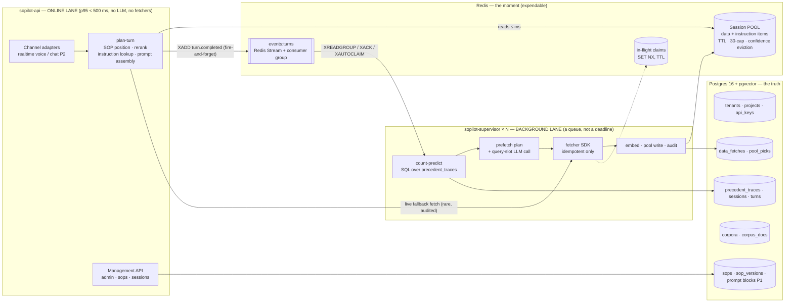
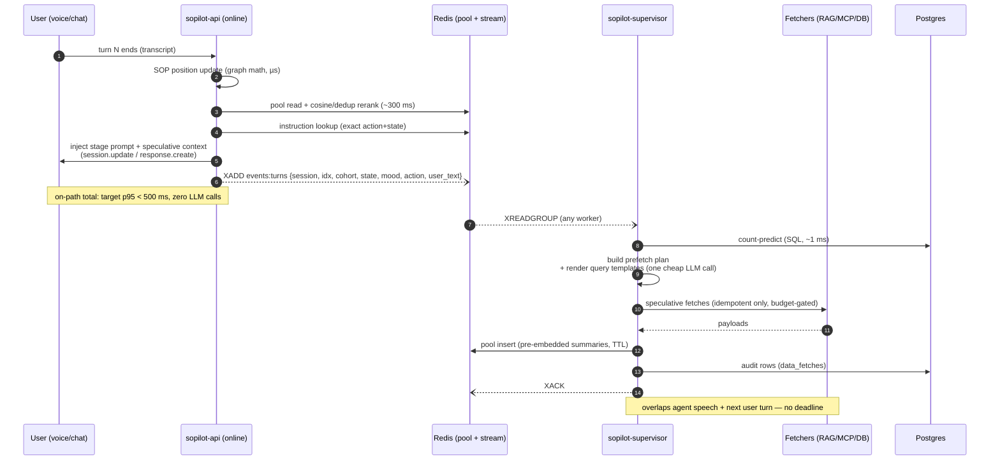
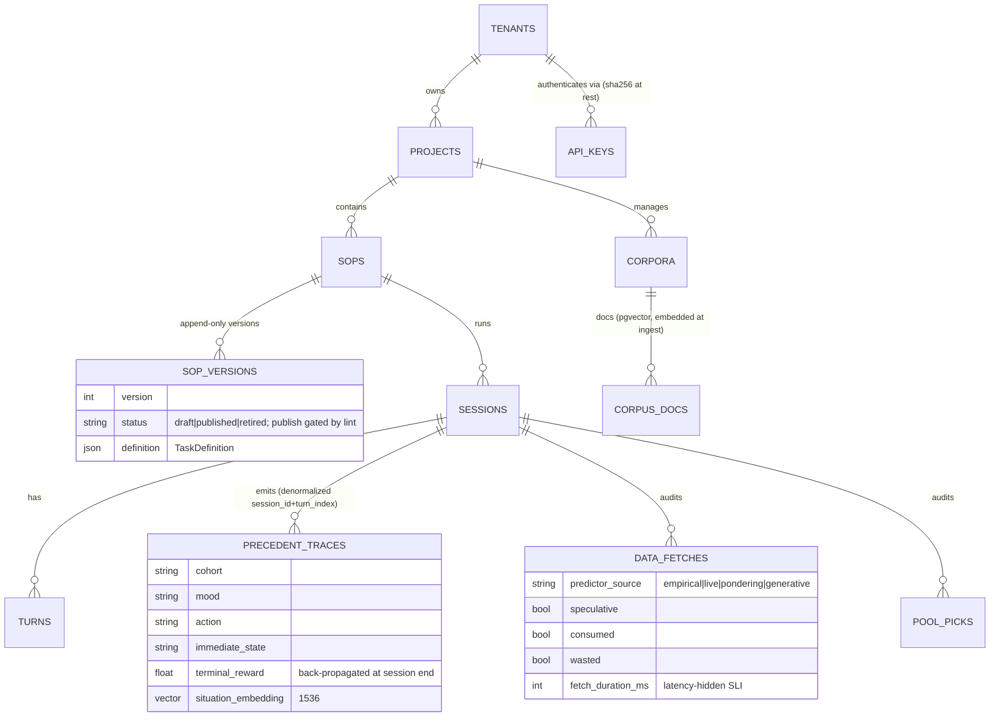

# SOPilot Architecture

**What SOPilot is:** a multi-tenant platform that manages AI conversation agents —
voice-first — against Standard Operating Procedures. A written procedure becomes a
versioned, lintable **conversation graph**; every live conversation is tracked
against that graph in the background; and at each turn the agent receives the
right stage instructions and the right pre-fetched customer data, with zero AI
calls and zero external lookups on the latency-critical path.

**How, in one paragraph:** two subsystems meet at a per-session **pool**.
*SOP & prompt management* (online, deterministic, p95 < 500 ms) tracks the
conversation's position in the graph, selects the best pre-staged context, and
assembles the per-turn prompt. *Predicted retrieval* (background, no deadline)
predicts the next 1–3 turns from the tenant's own conversation history, fetches
the data those turns will need, and stages it in the pool before it's asked for.
A wrong prediction just expires unused; a right one turns a multi-second lookup
into a millisecond read.

This file is the engineer-facing reference; the self-contained review edition
(for readers without repo access or prior context) is
[`docs/BLOG_SOPILOT_ARCHITECTURE.html`](docs/BLOG_SOPILOT_ARCHITECTURE.html), and
the product case is [`docs/BLOG_SOPILOT_KICKOFF.html`](docs/BLOG_SOPILOT_KICKOFF.html).
Evidence base: [MCPlanner](https://github.com/dsivov/MCPlanner) (small-N simulator
results — design guidance, not production claims).

**Terminology bridge** (review-edition term ↔ code term used below):

| Review edition says | Code / this doc says |
|---|---|
| context selection | pool rerank (cosine + dedup, `rerank.py`) |
| precedent lookup / precedent predictor | empirical predictor (self-join SQL, `predictor.py`) |
| indexed for meaning-search | embedded (pgvector) |
| one small AI call drafts queries | `{user_text}` query-slot LLM call |
| pre-drafted instruction | instruction-kind `PoolItem` (Milestone B) |

**Status:** P0 substrate verified (43 unit tests, 14-check two-tenant smoke test,
17-check live e2e). **P0 exit criterion closed:** POC parity reproduced on this
stack — speculative hit 90.7→96.3% (POC ~91%), live-fallback 9.3→3.7% (POC ~9%);
see [`bench/BENCH_P0_PARITY.md`](bench/BENCH_P0_PARITY.md). Open item from the
bench: plan-turn p95 890ms vs the 500ms voice target (cause + P2 remediations in
the report).

---

## 1. Topology — one codebase, two deployables (D-1)

The invariant inherited from the research: **nothing smart on the critical path.**
The online lane only reads the pool; everything slow, generative, or external runs
in supervisor workers behind a durable stream.

- **Dev mode:** `SOPILOT_EMBEDDED_SUPERVISOR=true` runs a supervisor consumer inside
  the API process — same code path, same bus, one process. Production runs them
  separately. Nothing is rewritten between modes.
- **Why a stream, not fire-and-forget tasks:** durable (survives worker crash via
  `XAUTOCLAIM`), retryable, and observable (pending-entry age = supervisor lag, the
  background lane's single health number).
- **What stays on-path deliberately:** pool rerank (~300 ms, pure math + one
  embedding call), instruction lookup (Redis read), and the live fallback fetch
  (the one legitimately blocking op; target <10% of consumed fetches).

## 2. The per-turn contract

Prompt contracts (unit-tested, non-negotiable):

1. Injected context is always labelled **speculative** — "may or may not fit this
   turn … if nothing fits, reply naturally" (framing ablation: 4/5 vs 3/5).
2. Instruction hits are served **verbatim** from the pool; if we don't trust a
   pre-generated instruction enough to say it, it doesn't enter the pool.
3. A pool miss **never blocks**: baseline stage prompt + audited live fallback.

## 3. Data model

**Postgres = the truth** (lifecycle + audit obligations). **Redis = the moment**:
pool hash per session (`sop:{tenant}:{project}:pool:{session}`), in-flight claim
keys, the turn-event stream. A Redis flush degrades to cold-start behaviour (more
live fallbacks for a few turns, all audited) — nothing in Redis is ever the only
copy of anything that matters (D-3).

Retention (lock at P1): audit raw 90 days → aggregates; `precedent_traces`
indefinitely (they are the accumulated moat; recency decay discounts staleness);
sessions/turns per tenant contract.

## 4. Tenancy & security (D-4)

- Spine: **tenant → project → SOP**. Request auth = bearer API key (sha256 at
  rest) + `X-Project` header → immutable `Scope(tenant_id, project_id)`.
- Every SQL query filters the spine; every Redis key goes through
  `Scope.redis_prefix()`. No unscoped access path exists; the smoke test asserts
  cross-tenant 404s.
- **Precedent traces are tenant-scoped by construction** — one tenant's
  conversational habits never inform another's predictions.
- Roadmap: per-project keys + runtime/manage/admin roles (P1); per-tenant secret
  store for fetcher credentials before the first real MCP/API connector (P2);
  per-tenant rate + speculative-budget quotas (P2).

## 5. Module map (`backend/sopilot/`)

| Module | Role | Research verdict encoded |
|---|---|---|
| `schemas.py` | TaskDefinition (SOP JSON contract) | POC schema minus retired knobs |
| `sop_graph.py` | allowed-actions + publish linter | action-prereq/state-trigger split (credit-card fix) |
| `predictor.py` | empirical counting predictor (PG self-join) | 88% recall@3 at ~0 tokens; decay+shrinkage, no Thompson |
| `pool.py` | Redis session pool + in-flight claims | misprediction tolerance (96% vs 11%) |
| `rerank.py` | cosine+dedup curation + speculative framing block | ~300 ms no-LLM rerank; honest framing contract |
| `prefetch.py` | schedule/consume lifecycle + audit | idempotency enforced at schedule time |
| `fetchers/` | SDK: mock, RAG-over-pgvector, MCP stub | corpora embedded at ingest |
| `scheduler.py` | PASTE speculative budget + preemption | speculative work yields to the live turn |
| `tenancy.py` | Scope + API keys | storage-layer isolation |
| `api/` | admin, sops (lint/publish), sessions (+pool X-ray) | — |

## 6. SLIs (wired from the audit tables, day one)

| SLI | Definition | Target |
|---|---|---|
| Effective hit rate | turns with ≥1 pool pick ÷ data-dependent turns | ≥ 70% (alert < 60%) |
| Live-fallback rate | non-speculative ÷ consumed fetches | < 10% |
| Plan-turn latency | on-path wall-clock | p95 < 500 ms |
| Latency hidden | Σ consumed speculative `fetch_duration_ms` / session | trend (the value story) |
| Supervisor lag | stream pending-entry age | < median inter-turn gap |

## 7. Decision log

| # | Decision | Basis |
|---|---|---|
| D-1 | One package, two deployables (`sopilot-api` / `sopilot-supervisor`), Redis Streams consumer group between; embedded flag for dev | lanes differ in latency contract, scaling, blast radius; durable queue > fire-and-forget |
| D-2 | Pool is the only inter-lane interface; rerank + instruction lookup + live fallback stay on-path | research invariant + latency budget |
| D-3 | Postgres = truth, Redis = expendable; a flush degrades, never loses | designed-for cold start |
| D-4 | Scope-mediated storage-layer isolation; tenant-scoped precedents | multi-tenant requirement; smoke-tested |
| D-5 | Speculative framing + verbatim instruction hits are unit-tested prompt contracts | framing ablation 4/5 vs 3/5 |
| D-6 | Lint is a publish blocker (structural → semantic over time) | credit-card SOP post-mortem |
| D-7 | Prompt blocks versioned separately from SOPs; bindings pinned at session start | governance requirement |
| D-8 | Pondering behind a flag, off by default, pause-aware | mistested at zero-pause (86% with think-time) |
| D-9 | Subsystem modes `sop` \| `retrieval` \| `both` at THREE levels: deployment default (`SOPILOT_SUBSYSTEMS`) → project (`projects.subsystems`, editable via `PATCH /admin/projects/{slug}`) → **session override** (`POST /sessions {subsystems}`, wins when set; also a Playground selector) | customers can buy either half alone AND A/B per session; `sop` = prompt/instruction management with live data resolution (no speculation, no pool); `retrieval` = prediction + prefetch + context selection only (customer owns prompting — converse/voice fall back to serving the context block as the payload); position tracking always on — both halves key off it |

| D-10 | **Systems vs bindings** for retrieval config: connection details (URL, auth-secret ref, tool name, tuning defaults) live in a project-level **connector registry** (`connectors` table, `/connectors` API + Studio view with health stats and a live test probe); SOP stages bind by NAME only (`data_dependencies[].config.connector`), optionally overriding tuning keys; resolution happens at the single fetch choke point (`prefetch._run_fetch`) for BOTH speculative and live-fallback paths, and the audit trail records which connector served each fetch | swapping a RAG/MCP/tool never republishes an SOP; per-stage "best system per stage" is just different names on different stages' deps; unknown/disabled connector → audited fetch failure + graceful live degradation (never a crash); credentials stay in Fernet-encrypted tenant secrets, referenced by name |

Conventions: online migrations follow **expand → migrate → contract** (never
destructive in one step); embedding model changes require corpus re-embed (vector
search breaks silently otherwise).

## 8. Runtime entrypoints & modes

- **API (online lane):** `uvicorn sopilot.api.app:app` — plan-turn
  (`POST /sessions/{id}/plan-turn`), outcome back-propagation
  (`POST /sessions/{id}/outcome`), SOP/session/admin routes.
- **Supervisor (background lane):** `sopilot-supervisor` console script, N
  replicas; consumer group over `sopilot:events:turns` (XREADGROUP / XACK /
  XAUTOCLAIM; poison events are logged + dropped — live fallback covers them).
- **Dev single-process:** `SOPILOT_EMBEDDED_SUPERVISOR=true` runs one consumer
  inside the API process. Same code path, same stream.
- **Subsystem modes (D-9):** three levels, most specific wins —
  1. deployment default `SOPILOT_SUBSYSTEMS` (default `both`);
  2. project: `POST /admin/projects {"subsystems": ...}` at creation, or
     `PATCH /admin/projects/{slug} {"subsystems": "sop"|"retrieval"|"both"|""}`;
  3. session: `POST /sessions {"sop_id": ..., "subsystems": "sop"}` overrides
     for that session only (exposed in the Playground's start card; the
     effective mode shows in session lists and the X-ray chip).
  Gating: plan-turn assembles the stage prompt only when SOP management is on,
  returns the speculative context block only when retrieval is on; the
  supervisor skips prediction/prefetch when retrieval is off (events still
  flow for audit).
- **E2E check:** `scripts/e2e_check.py` (train precedents → supervisor prefetch →
  speculative consume; verifies all three modes over HTTP).

## 9. Build order (P1 continues)

1. ~~**D-1 implementation** — turn-event stream, `sopilot-supervisor` entrypoint,
   embedded-dev flag~~ ✅ done, with D-9 subsystem modes.
2. ~~**Bench harness + POC parity run**~~ ✅ done — parity closed, see
   `bench/BENCH_P0_PARITY.md`.
3. ~~**Local check script**~~ ✅ `scripts/check.sh` (no hosted CI by decision).
4. ~~**Prompt-block model + bindings (D-7)**~~ ✅ done — versioned library
   (`/prompt-blocks` CRUD + publish), publish gate on SOPs binding unpublished
   blocks, bindings snapshotted into the session at start (mid-call
   immutability verified live), assembly order: role header → authored blocks →
   stage constraints.
3. **CI** — ruff + unit + compose-based integration on push.
4. **Prompt-block model + stage bindings** (D-7).
5. ~~**Document → draft-SOP ingestion + continuous editor linting**~~ ✅ done —
   `/sops/ingest` (policy text → lint-clean draft, ~10 s), `/sops/build-turn`
   (conversational refinement, smallest-patch merge), `/sops/lint-definition`
   (stateless, powers live editor linting); **Studio UI v1** in `frontend/`
   (design-guide shell: SOPs editor + live lint + ingest + chat refinement,
   prompt-block library, sessions pool X-ray; vite dev on 0.0.0.0:5174,
   `/api` proxy to the backend).
6. ~~SOP graph visualization~~ ✅ (draggable, click→stage inspector with
   prompt-block bind/unbind); ~~PDF upload~~ ✅ (+ example asset, provenance
   Source tab).
7. **P2 shipped:** text channel (`/converse`: classify+propose → plan →
   respond, strong-model classifier per the collapse evidence) + voice
   channel (`/realtime-token` GA-minted ephemeral secret, `/voice-turn`,
   Playground WebRTC call with per-turn session.update steering — live mic
   test passed) + **Milestone B instruction pre-generation** (supervisor
   drafts replies for top (next-action, next-state) combos on the
   speculative budget; verbatim serving on exact match; first live e2e 3/4
   hits, fastest hit 1.28 s). Latency remediation: classify ∥ query-embed.
8. Next: instruction-hit bench N≥20 (claim gate), Ops dashboard
   (`/metrics/summary` + Dashboard view), per-tenant quotas + connector
   secrets, then P3 proof work (SOPBench harness — NOT SOP-Maze, which is
   Chinese-only; decision 2026-07-15).

Production gap ledger (ranked): durable background work (→ #1), benchmark parity
(→ #2), CI/load profile (→ #3), migration discipline at scale, secrets for
connectors, and the open P2 classify decision (realtime-model tool call vs fast
sidecar — the gpt-4o-mini collapse warns against assuming cheap works).
